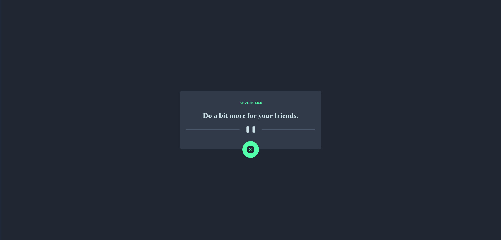

# Frontend Mentor - Advice generator app solution

This is a solution to the [Advice generator app challenge on Frontend Mentor](https://www.frontendmentor.io/challenges/advice-generator-app-QdUG-13db). Frontend Mentor challenges help you improve your coding skills by building realistic projects.

## Table of contents

- [Overview](#overview)
  - [The challenge](#the-challenge)
  - [Screenshot](#screenshot)
  - [Links](#links)
- [My process](#my-process)
  - [Built with](#built-with)
  - [Features](#features)
  - [What I Learned](#what-i-learned)
  - [Useful Resources](#useful-resources)
- [Author](#author)

## Overview

### The challenge

Users should be able to:

- View the optimal layout for the app depending on their device's screen size
- See hover states for all interactive elements on the page
- Generate a new piece of advice by clicking the dice icon

### Screenshot

### Links

- Solution URL: [GitHub Repository](https://github.com/TedJenkler/Advice-Generatorapp-Scss)
- Live Site URL: [Live Demo](https://tedjenkler.github.io/Advice-Generatorapp-Scss/)

## My process

### Built with

- [Vite](https://vitejs.dev/) - A frontend build tool for fast development with a modern workflow.
- [React](https://reactjs.org/) - A JavaScript library for building user interfaces.
- [SCSS](https://sass-lang.com/documentation) - For advanced styling and creating flexible, maintainable stylesheets.
- [Axios](https://axios-http.com/docs/intro) - For making HTTP requests and handling data fetching.

These tools and technologies were used to build a responsive and efficient application, enhancing both development experience and user experience.

### Features

Users can:

- **Responsive Design:** Experience a layout that adjusts seamlessly across different screen sizes and devices, ensuring optimal user experience.
- **Fetch Data:** Retrieve data from an external API using Axios for dynamic content updates.
- **Refetch Data with Custom Hook:** Efficiently manage data fetching and state updates with a custom React hook, providing a more streamlined approach to data handling.
- **Box Shadow Effects:** Enhance the visual appeal of UI elements with CSS box-shadow effects, improving aesthetics and user interaction feedback.

These features focus on delivering a responsive, data-driven application with a polished user interface, leveraging modern techniques for a better user experience and code maintainability.

### What I Learned

During this project, I gained more experience in the following areas:

- **SCSS:** Deepened my understanding of SCSS, including advanced features like mixins, variables, and responsive design techniques. This allowed me to create more maintainable and adaptable stylesheets.
- **Axios:** Enhanced my skills with Axios for making HTTP requests, handling responses, and managing async data fetching more efficiently in a React environment.
- **Custom Hooks:** Expanded my experience in developing and utilizing custom React hooks, leading to better code organization, reusability, and abstraction of logic.

These advancements have significantly contributed to my development process, improving my ability to build well-styled, data-driven applications with reusable components and efficient data handling.

### Useful Resources

- [SCSS Documentation](https://sass-lang.com/documentation) - For comprehensive details on SCSS syntax and features.
- [Axios Documentation](https://axios-http.com/docs/intro) - For guidance on making HTTP requests and handling responses with Axios.
- [Vite Documentation](https://vitejs.dev/) - For understanding and configuring Vite as a build tool and development server.

## Author

- Frontend Mentor - [@TedJenkler](https://www.frontendmentor.io/profile/TedJenkler)
- LinkedIn - [Teodor Jenkler](https://www.linkedin.com/in/tedjenklerwebdeveloper/)
- X - [@TJenkler](https://x.com/TJenkler)